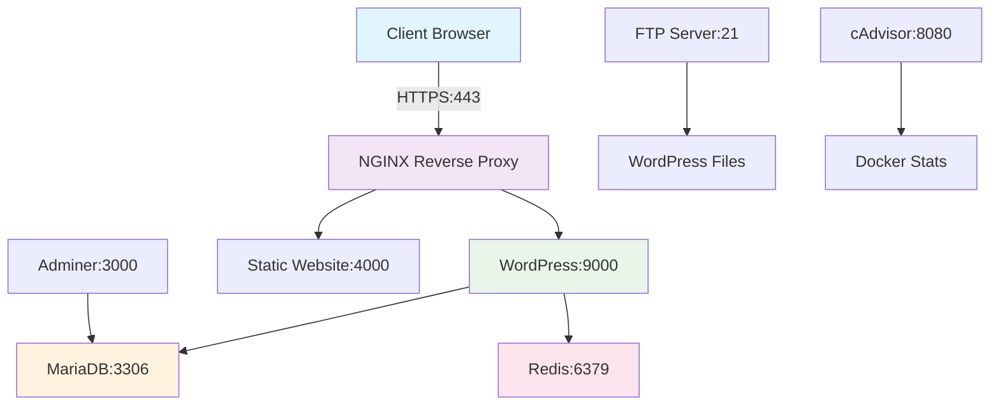

# 🐳 INCEPTION - Docker Infrastructure Project

<div align="center">


**A comprehensive containerized web infrastructure built for 42 School (1337 Morocco)**

---

*"System administration related exercise - Virtualizing several Docker images, creating them in your new personal virtual machine."*

</div>

## 📋 Table of Contents

- [🌟 Overview](#-overview)
- [🏗️ Architecture](#️-architecture)
- [🔧 Services](#-services)
- [🎁 Bonus Services](#-bonus-services)
- [🚀 Quick Start](#-quick-start)
- [📁 Project Structure](#-project-structure)
- [🔐 Security Features](#-security-features)
- [⚙️ Configuration](#️-configuration)
- [📊 Monitoring](#-monitoring)
- [🛠️ Development](#️-development)
- [📝 42 School Requirements](#-42-school-requirements)

## 🌟 Overview

INCEPTION is a Docker-based infrastructure project that demonstrates advanced containerization concepts and microservices architecture. This project creates a complete web hosting environment using Docker containers with custom-built images from Debian 12.

### Key Features

- 🔒 **HTTPS/TLS 1.3 Only** - Secure communication
- 🐘 **Custom Docker Images** - Built from scratch using Debian 12
- 🔄 **Container Orchestration** - Using Docker Compose
- 📊 **Monitoring & Analytics** - Integrated monitoring solutions
- 🗃️ **Persistent Storage** - Volume management for data persistence
- 🌐 **Multi-service Architecture** - Microservices design pattern

## 🏗️ Architecture



## 🔧 Services

### Core Services (Mandatory)

#### 🌐 NGINX (Port 443)
- **SSL/TLS Configuration**: Only TLSv1.3 protocol
- **Custom SSL Certificates**: Self-signed certificates
- **Reverse Proxy**: Routes requests to appropriate services
- **Static Content**: Serves WordPress files

#### 📝 WordPress (Port 9000)
- **PHP-FPM**: FastCGI Process Manager
- **Redis Integration**: Object caching support
- **Multi-user Setup**: Admin and regular user accounts
- **Volume Mounting**: Persistent file storage

#### 🗄️ MariaDB (Port 3306)
- **Database Engine**: MySQL-compatible database
- **Environment Variables**: Configurable credentials
- **Persistent Storage**: Data volume mounting
- **Network Isolation**: Internal network communication

## 🎁 Bonus Services

#### 🛡️ Adminer (Port 3000)
Database administration interface for easy database management.

#### ⚡ Redis (Port 6379)
In-memory caching solution for WordPress performance optimization.

#### 📁 FTP Server (Port 21)
File transfer protocol server for WordPress file management.
- **Passive Mode Ports**: 21100-21110
- **WordPress Integration**: Direct access to WordPress files

#### 🌍 Static Website (Port 4000)
Custom profile website showcasing frontend development skills.

#### 📊 cAdvisor (Port 8080)
Container monitoring and performance analytics dashboard.

## 🚀 Quick Start

### Prerequisites

- Docker Engine 20.10+
- Docker Compose V2
- Linux environment (tested on Debian/Ubuntu)

### Installation

1. **Clone the repository**
   ```bash
   git clone https://github.com/Xylar-99/INCEPTION.git
   cd INCEPTION
   ```

2. **Set up environment variables**
   ```bash
   # Create .env file in srcs/ directory
   cp srcs/.env.example srcs/.env
   # Edit the .env file with your configurations
   ```

3. **Create data directories**
   ```bash
   sudo mkdir -p /home/$(whoami)/data/files
   sudo mkdir -p /home/$(whoami)/data/database
   ```

4. **Build and start services**
   ```bash
   make up
   ```

5. **Access your services**
   - WordPress: `https://yourdomain.42.fr`
   - Adminer: `https://yourdomain.42.fr/adminer`
   - Static Site: `https://yourdomain.42.fr/website`
   - cAdvisor: `https://yourdomain.42.fr/cadvisor`

### Management Commands

```bash
# Start all services
make up

# Stop all services  
make down

# Clean up everything (including volumes)
make fclean

# Rebuild everything
make re
```

## 📁 Project Structure

```
INCEPTION/
├── 📄 Makefile                     # Project management commands
├── 📄 README.md                    # This file
└── 📁 srcs/
    ├── 📄 docker-compose.yml       # Container orchestration
    └── 📁 requirements/
        ├── 📁 nginx/               # Web server configuration
        │   ├── 🐳 Dockerfile
        │   ├── 📁 conf/
        │   └── 📁 tools/
        ├── 📁 wordpress/           # CMS configuration
        │   ├── 🐳 Dockerfile
        │   ├── 📁 conf/
        │   └── 📁 tools/
        ├── 📁 mariadb/            # Database configuration
        │   ├── 🐳 Dockerfile
        │   └── 📁 tools/
        └── 📁 bonus/              # Additional services
            ├── 📁 adminer/
            ├── 📁 cadvisor/
            ├── 📁 ftp/
            ├── 📁 redis/
            └── 📁 website/
```

## 🔐 Security Features

- **🔒 HTTPS Only**: All traffic encrypted with TLS 1.3
- **🏗️ Custom Images**: Built from official Debian base images
- **🔐 Network Isolation**: Services communicate through private networks
- **📝 Environment Variables**: Sensitive data managed securely
- **🚫 No Passwords in Images**: All credentials externalized

## ⚙️ Configuration

### Environment Variables

Create a `.env` file in the `srcs/` directory:

```env
# Database Configuration
DB_WP=wordpress_db
USER_WP=wp_user
PASS_WP=secure_password
HOST_WP=mariadb

# WordPress Users
USER_01=admin_user
PASS_USER_01=admin_password
USER_02=regular_user  
PASS_USER_02=user_password

# Redis Configuration
HOST_REDIS=redis
PORT_REDIS=6379

# Domain
DOMAIN=yourdomain.42.fr
```

### Volume Configuration

Update the volume paths in `docker-compose.yml` to match your system:

```yaml
volumes:
  wp_files:
    driver_opts:
      device: /home/yourusername/data/files/
  database:
    driver_opts:
      device: /home/yourusername/data/database/
```

## 📊 Monitoring

### cAdvisor Dashboard
Access real-time container metrics at `https://yourdomain.42.fr/cadvisor`

**Features:**
- CPU and Memory usage
- Network I/O statistics
- Container lifecycle events
- Historical performance data

### Health Checks
```bash
# Check container status
docker ps

# View service logs
docker compose -f srcs/docker-compose.yml logs [service_name]

# Monitor resource usage
docker stats
```

## 🛠️ Development

### Adding New Services

1. Create service directory in `requirements/bonus/`
2. Add Dockerfile and configuration files
3. Update `docker-compose.yml`
4. Configure networking and volumes
5. Test service integration

### Debugging

```bash
# Enter container shell
docker exec -it [container_name] /bin/bash

# View service logs
docker compose logs -f [service_name]

# Check network connectivity
docker network inspect inception
```

## 📝 42 School Requirements

### ✅ Mandatory Requirements

- [x] NGINX with TLSv1.3 only
- [x] WordPress + php-fpm
- [x] MariaDB database
- [x] Custom Dockerfiles (no pre-built images)
- [x] Persistent volumes
- [x] Docker network
- [x] Container restart policies

### ✅ Bonus Requirements

- [x] Redis cache for WordPress
- [x] FTP server pointing to WordPress files  
- [x] Adminer for database management
- [x] Static website (not WordPress/PHP)
- [x] cAdvisor for monitoring

### 📚 Learning Objectives

This project demonstrates mastery of:

- **🐳 Docker**: Container creation and management
- **🔧 System Administration**: Service configuration and deployment
- **🌐 Web Technologies**: NGINX, PHP, MySQL stack
- **🔒 Security**: SSL/TLS, network isolation
- **📊 Monitoring**: Performance tracking and analytics
- **🏗️ Architecture**: Microservices design patterns

---

## 👨‍💻 Author

**Abdelbassat Quaoub** - Student at 42 School (1337 Morocco)

- GitHub: [@Xylar-99](https://github.com/Xylar-99)
- 42 Intra: `abquaoub`

## 📄 License

This project is created for educational purposes as part of the 42 School curriculum.

---

<div align="center">

**🎓 Made with ❤️ at 42 School (1337 Morocco)**

*"The best way to learn is by doing"*

</div>
